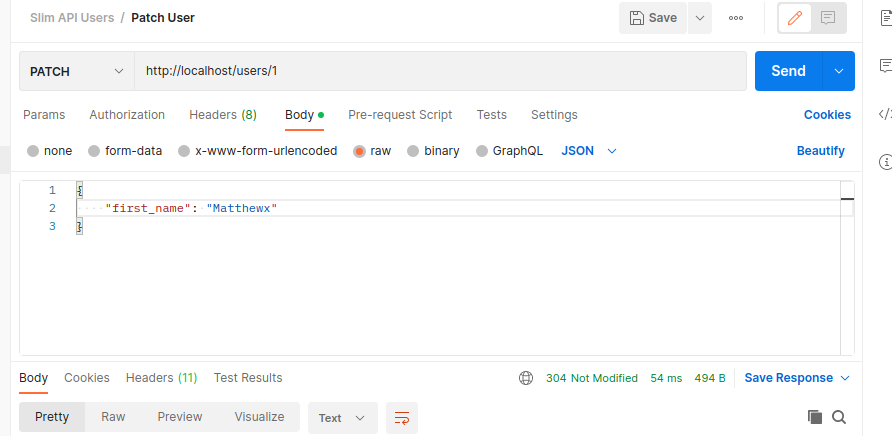

# Slim Framework 4 Users REST API

Basic RestAPI using SLIM Framework 4 with user addition and editing.

In addition, all application logs are put away in AMQP for later transfer to e.g. elastic search.

**The collection for Postman is located in the repo directory in the file slim-api-users.postman_collection.json**

## Install the Application

Download the repository and then copy the .env.dist file to .env, then run everything with the
```bash
docker-compose up
```

After that, open `http://localhost:80` in your browser.

That's it! Now go build something cool.

## Requests

### Request

`GET /users/{id}`

### Response
```shell
HTTP/1.1 200 OK
Date: Mon, 08 May 2023 20:01:41 GMT
Content-Type: application/json
Transfer-Encoding: chunked
Connection: keep-alive
Access-Control-Allow-Credentials: true
Access-Control-Allow-Origin:
Access-Control-Allow-Headers: X-Requested-With, Content-Type, Accept, Origin, Authorization
Access-Control-Allow-Methods: GET, POST, PUT, PATCH, DELETE, OPTIONS
Cache-Control: no-store, no-cache, must-revalidate, max-age=0
Cache-Control: post-check=0, pre-check=0
Pragma: no-cache

{
"statusCode": 200,
"data": {
"id": 1,
"first_name": "Matthew",
"last_name": "Fri\u00f0rik",
"email": "xhakiersman13372@soombo.com",
"pesel": "51103179993",
"contact_emails": []
}
```

============================
### Request

`POST /users`
```json
{
  "statusCode": 200,
  "data": {
    "id": 1,
    "first_name": "Matthew",
    "last_name": "Friðrik",
    "email": "xhakiersman13372@soombo.com",
    "pesel": "51103179993",
    "contact_emails": []
  }
}
```

### Response
```shell
HTTP/1.1 201 CREATED
Date: Mon, 08 May 2023 20:01:41 GMT
Content-Type: application/json
Transfer-Encoding: chunked
Connection: keep-alive
Access-Control-Allow-Credentials: true
Access-Control-Allow-Origin:
Access-Control-Allow-Headers: X-Requested-With, Content-Type, Accept, Origin, Authorization
Access-Control-Allow-Methods: GET, POST, PUT, PATCH, DELETE, OPTIONS
Cache-Control: no-store, no-cache, must-revalidate, max-age=0
Cache-Control: post-check=0, pre-check=0
Pragma: no-cache

{
    "statusCode": 201,
    "data": {
        "id": 1
    }
}
```

============================
### Request

`PUT /users/{id}`
```json
{
  "first_name": "Varnava",
  "last_name": "Friðrik",
  "pesel": "51103179993",
  "email": "hakiersman13372@soombo.com", // temp mail
  "contact_emails": []
}
```

### Response
```shell
HTTP/1.1 200 OK
Date: Mon, 08 May 2023 20:01:41 GMT
Content-Type: application/json
Transfer-Encoding: chunked
Connection: keep-alive
Access-Control-Allow-Credentials: true
Access-Control-Allow-Origin:
Access-Control-Allow-Headers: X-Requested-With, Content-Type, Accept, Origin, Authorization
Access-Control-Allow-Methods: GET, POST, PUT, PATCH, DELETE, OPTIONS
Cache-Control: no-store, no-cache, must-revalidate, max-age=0
Cache-Control: post-check=0, pre-check=0
Pragma: no-cache

{
    "statusCode": 200,
    "data": {
        "updated": 1
    }
}
```

============================
### Request

`PATCH /users/{id}`
```json
{
  "first_name": "Matthew"
}
```

### Response
```shell
HTTP/1.1 200 OK
Date: Mon, 08 May 2023 20:01:41 GMT
Content-Type: application/json
Transfer-Encoding: chunked
Connection: keep-alive
Access-Control-Allow-Credentials: true
Access-Control-Allow-Origin:
Access-Control-Allow-Headers: X-Requested-With, Content-Type, Accept, Origin, Authorization
Access-Control-Allow-Methods: GET, POST, PUT, PATCH, DELETE, OPTIONS
Cache-Control: no-store, no-cache, must-revalidate, max-age=0
Cache-Control: post-check=0, pre-check=0
Pragma: no-cache

{
    "statusCode": 200,
    "data": {
        "updated": 1
    }
}
```
304:


404:


409:


201:


200:

